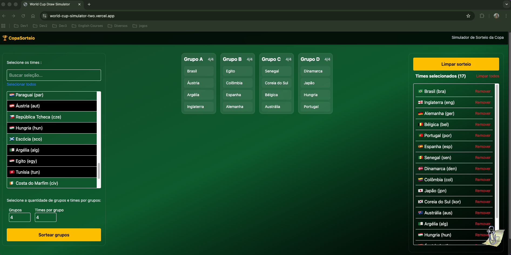

# 🌍 World Cup Draw Simulator

## 📸 Preview



## 🔗 Demo

👉 https://world-cup-simulator-two.vercel.app/

## 📌 Sobre o projeto

Aplicação web interativa que permite simular o sorteio da fase de grupos da Copa do Mundo, com foco em experiência do usuário, organização de código e separação de responsabilidades.

O projeto foi desenvolvido como parte de um desafio técnico com ênfase em arquitetura front-end, testes automatizados e boas práticas.

## 🚀 Funcionalidades

Abaixo, detalhamento das principais funcionalidades:

- 🔎 Busca de seleções por nome ou código
- ➕ Seleção e remoção de times participantes
- ⚙️ Configuração dinâmica do sorteio (grupos e tamanho)
- 🎲 Geração automática de grupos (fase de grupos)
- 🔁 Re-sorteio dos grupos
- 💾 Persistência de dados com localStorage
- 🚫 Validações (mínimo de seleções, duplicidade)
- 📊 Exibição organizada dos grupos sorteados
- ♿ Suporte básico à acessibilidade (ARIA roles)

### 🔎 Catálogo de seleções

- Busca por nome ou código (ex: "Brasil", "BRA")
- Lista dinâmica com feedback visual de seleção
- Botão de **selecionar todos / remover todos**
- Interface acessível com:
  - `role="combobox"`
  - `role="listbox"`
  - `role="option"`

---

### ⚙️ Configuração do sorteio

- Definição de:
  - quantidade de grupos
  - times por grupo

- Validação automática:
  - impede sorteio sem times suficientes

---

### 🎲 Simulação do sorteio

- Distribuição automática dos times
- Criação dos grupos (ex: Grupo A, B, C...)
- Interface visual com os grupos organizados

---

### 💾 Persistência

- Dados salvos no `localStorage`:
  - seleções sorteadas
  - configuração (grupos × tamanho)

- Recuperação automática ao recarregar a página

---

## 🧱 Arquitetura

O projeto foi organizado separando responsabilidades:

```
src/
├── components/ # UI (React)
│   ├── GroupCard
│   ├── Navbar
│   ├── Card
│   ├── DrawPanel
├── domain/           # Regras de negócio (drawGroups)
├── hooks/            # Lógica reutilizável (useTeams)
├── store/            # Estado global (Zustand)
├── utils/            # Funções puras (filtro, normalização)
├── types/            # Tipagens
```

---

## 🧠 Decisões técnicas

### Zustand vs Redux

Foi utilizado **Zustand** por:

- Simplicidade e menor boilerplate
- Integração direta com React
- Ideal para aplicações pequenas/médias
- Melhor legibilidade no contexto do desafio

---

### Separação de domínio

A lógica de sorteio (`drawGroups`) foi isolada em `domain/`:

- Facilita testes
- Evita acoplamento com UI
- Permite evolução futura (API, regras FIFA, etc.)

---

### Persistência

O uso de `localStorage` garante:

- Experiência contínua para o usuário
- Simulação de estado real de aplicação

---

## 🧪 Testes

Foram implementados testes com **Vitest + Testing Library**:

### ✔️ Testes unitários

- `normalizedString`
- `filterTeams`
- `drawGroups`

### ✔️ Testes de integração

- Fluxo completo:
  - selecionar times
  - realizar sorteio

- Persistência com `localStorage`

---

## ♿ Acessibilidade

- Uso de roles semânticos (`combobox`, `listbox`, `option`)
- Navegação preparada para teclado
- Estrutura compatível com leitores de tela

---

## 🎨 UI/UX

- Layout responsivo (mobile-first)
- Grid adaptativo para exibição dos grupos
- Feedback visual de seleção
- Estados desabilitados (botão de sorteio)
- Mensagens de validação claras
- Scroll automático após sorteio
- Componentes reutilizáveis (Card, GroupCard)

---

## 📦 Tecnologias

- React
- TypeScript
- Zustand
- Vitest
- Testing Library
- Tailwind CSS

---

## ▶️ Como rodar o projeto

```bash
# instalar dependências
npm install

# rodar o projeto
npm run dev
npm run build
npm run preview

# rodar testes
npm run test
```

---

### Escalabilidade

A arquitetura foi pensada para permitir evolução futura, como:

- Drag & drop entre grupos
- implementação de regras por potes (pots)
- restrições por confederação
- integração com APIs externas
- suporte a múltiplos sorteios

---

## 🤖 Uso de IA

Este projeto contou com auxílio de IA para:

- Refinamento de arquitetura
- Sugestões de testes
- Organização do código

Todas as decisões finais, implementação e validação foram realizadas manualmente.

---

## 👩‍💻 Autora

Camila Vicente

---

## 📎 Observações finais

Este projeto foi desenvolvido com foco em boas práticas de engenharia front-end, incluindo:

- organização em camadas
- separação de responsabilidades
- testabilidade
- experiência do usuário

## A solução foi pensada para ser evolutiva, permitindo a adição de regras mais complexas e integração com APIs reais.
